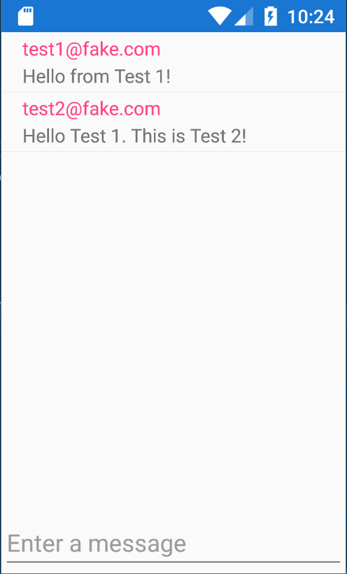

# XamarinFirebaseMessaging
Demo app that uses Xamarin.Forms and Google Firebase for a realtime messaging app

## Preview
Below is a preview of what the app will look like once set up for a logged in user
<p align="center">
  
</p>

# Setup

## Firebase Setup

### Realtime Database Setup
1. Create a new Firebase project on Google Firebase if you haven't already.
2. Create a realtime database.
3. Create an empty "messages" collection in your realtime database.
4. Add rules to your database under "Rules" tab and click publish

**Example Rules:**
```
{
  /* Visit https://firebase.google.com/docs/database/security to learn more about security rules. */
  "rules": {
    "messages": {
    	".read": "auth != null",
    	".write": "auth != null"
    }
  }
}
```
5. In code, fill in Constants.FIREBASE_REALTIME_DATABASE_BASE_URL and Constants.FIREBASE_API_KEY
- FIREBASE_REALTIME_DATABASE_BASE_URL can be found in the Database > Realtime Database view. It should be in a format like https://[project-id].firebaseio.com
- FIREBASE_API_KEY can be found in Gear Icon -> Project Settings -> General Tab (Web API Key)

**NOTE:**

It is recommend you run the following in your repository to avoid accidentally committing your Constants.cs with sensitive app keys:
```git update-index --assume-unchanged XamarinFirebaseMessaging\XamarinFirebaseMessaging\Constants.cs```

### Firebase Authentication Setup
1. Go to Authentication tab for your project in Google Firebase
2. Enable Email/Password authentication under Sign-in method tab
3. Create test users with emails and password under "Users" tab (the app does not yet have "Create account" functionality, so you'll need to create in the FirebaseUI for now)

## Microsoft AppCenter Setup
1. Go to https://appcenter.ms and create an account if you don't have one already
2. Create a new App targeting Android and Xamarin (You will need to make a separate app in appcenter for IOS and UWP if you desire)
3. Copy app key into Constants.ANDROID_APP_CENTER_KEY (app key can be found on Overview -> Getting Started after creating app)
